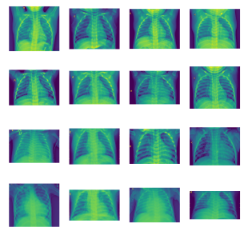

# Chest Xray Data
Working through the Kaggle Chest Xray dataset in Python and Keras/Tensorflow.This data consists of thousands of chest xrays. The chests are either normal(Healthy) , or sick(Pneumonia). The goal is to recoginize if a chest is healthy or sick based off the chest xray.

Is an image of some of the training data.
